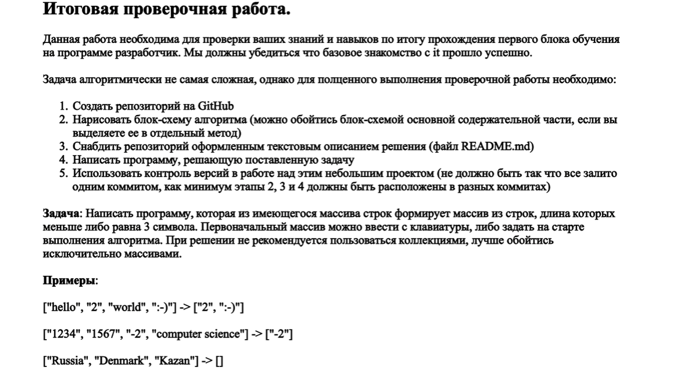

# Description of the task
***

## Задача
>
*Написать программу, которая из имеющегося массива строк формирует массив из строк, длина которых меньше либо равна 3 символам. Первоначальный массив можно ввести с клавиатуры, либо задать на старте выполнения алгоритма.__При решении не рекомендуется пользоваться коллекциями, лучше обойтись исключительно массивами.__* 

### Для выполнения задачи необходимо:

+ 1. Создать репозиторий на GitHub
+ 2. Нарисовать блок-схему алгоритма (*можно обойтись блок-схемой содержатеьной части, если выделить ее в отдельный метод*)
+ 3. Снабдить репозиторий оформленным текстовым описанием решения (__файл README.md__)
+ 4. Написать программу, решающую поставленную задачу
+ 5. Использовать контроль версий в работе над этим небольшим проектом (предпочтительно наличие от 4 коммитов)

#### Пример решения задачи
["hello", "2", "world", ":-)"] -> ["2", ":-)"]

["1234", "1567", "-2", "computer science"] -> ["-2"]

["Russia", "Denmark", "Kazan"] -> []

## Применяемые методы

В решении использованы два метода:

string[] SolveEx(string[] mass) - метод последовательно проверяет элементы начального массива на длину меньше или равную 3 и накапливает эти элементы в конечный массив.
>
string FinishString (string[] col) - метод фиксирует и выводит в строку все элементы массива.
По итогу реализованного программного кода выводим на экран изначально введенные данные массива и отсортированный по заданному условию конечный массив.

